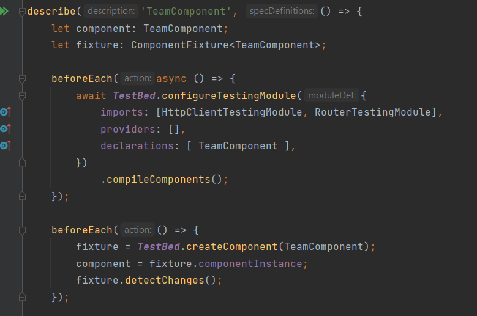
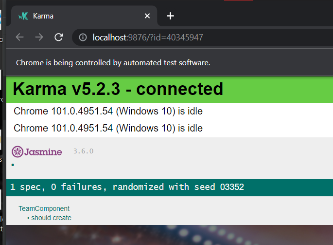
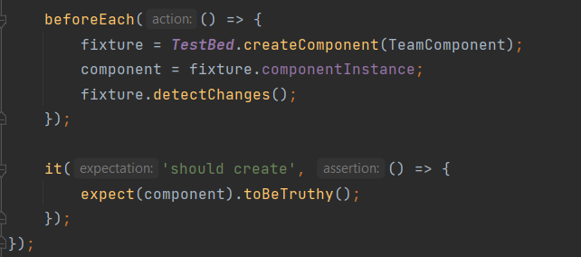
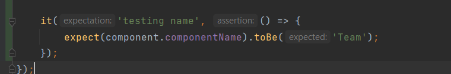

**Unit testing** is a type of automated testing meant to verify whether a small and isolated piece of the codebase—the so-called “unit”—behaves as the developer intended.

Here we are going to be testing the component Team. 

Unit tests are written using Jasmine

  

We can run Jasmine tests in a browser ourselves by setting up and loading a HTML file, but more commonly we use a command-line tool called Karma. 

Karma handles the process of creating HTML files, opening browsers and running tests and returning the results of those tests to the command line.

Testing with Jasmine is done by running all the **spec files** of the project( generated automatically with the creation of all components and services including the app component)

Here we deleted all spec file except for the <a href='https://github.com/bacembendaly99/octopus-predictions-frontend/blob/dev/src/app/components/team/team.component.spec.ts'>team.component.spec.ts</a> .

 
initialisation of the TestBed:
   

 
If we run `ng test` we get the Karma interface 

 

The first test is for the component creation:

The second test is to test an attribute inside the component : componentName.

